# Connecting to Your TEMPEST CubeSat

The TEMPEST image ships pre-provisioned: instead of joining an external wifi
network, each Pi Zero W broadcasts its own WiFi Access Point that workshop
attendees connect to directly. For a fleet of 25 units, you'll see
`TEMPEST-1` through `TEMPEST-25` advertised on the air — one SSID per
satellite, matching its hostname.

## Connecting from Your Laptop

1. Open your laptop's wifi settings.
2. Find the SSID matching the TEMPEST unit you want to use (e.g. `TEMPEST-3`).
3. Join using the shared workshop key: **`Hack Space`** (default — your
   instructor may have rotated it).
4. NetworkManager on the Pi runs DHCP + NAT in `shared` mode, so your laptop
   automatically picks up a lease in the `10.42.0.0/24` range.
5. SSH into the satellite at its AP gateway address:
    ```bash
    ssh tempest@10.42.0.1
    ```
    Default SSH credentials: `tempest` / `tempest`. Note that these are *not*
    the WiFi key — the AP password (`Hack Space`) gets you onto the network,
    the login above gets you a shell.

The Pi Zero W has a single radio, so each TEMPEST is its own isolated network —
you can only be connected to one satellite at a time.

## Rotating the AP Password

Once SSH'd in, change the PSK with:

```bash
sudo nmcli con modify tempest-ap wifi-sec.psk "new-password-here"
sudo nmcli con down tempest-ap && sudo nmcli con up tempest-ap
```

The down/up cycle is required — modifying the connection alone does not push
the new key to the running AP. Every connected client (including your current
SSH session) drops and must reconnect with the new key.

To check what the current PSK is set to (run as root for `-s`):

```bash
sudo nmcli -s con show tempest-ap | grep 802-11-wireless-security.psk:
```

## Querying the AP Over Radio

If the satellite is in radio range but you can't see its SSID for any reason,
the ground station can ask the FSW directly:

```
WIFI_INFO
```

The satellite responds with a `WIFI` telemetry packet containing the active
SSID (32 bytes) and IPv4 address (15 bytes). See
[Command Protocol](fsw/commands.md) and the
[Telemetry Reference](fsw/telemetry.md#wifi-wifi-access-point-info).

## Imaging a Fresh microSD Card

If you're setting up a new TEMPEST from scratch (e.g. replacing a damaged SD
card or upgrading the image), use `Raspberry Pi Imager`:

1. Download and install
   [Raspberry Pi Imager](https://www.raspberrypi.com/software/) for your OS.
2. Download a TEMPEST image:
    - TEMPEST v1.1:
      [Tempest_v1.1.img](https://drive.google.com/file/d/1K1Nw7Q_Xnd-AX9t3xWBUItROa7UGI167/view?usp=drive_link)
      — `SHA256: 1b8bcd935839535602cd83294fcc94d98414a8966752e596f9455d1c1249bfef`
3. Take the microSD card out of TEMPEST by removing the four T8 screws on the
   X+ Solar Panel (the panel to your left when facing the RBF pin / charging
   port).
4. In `Raspberry Pi Imager`, choose **`CHOOSE OS` → `Use custom`** and select
   the downloaded `.img` file, then choose your microSD card under
   **`CHOOSE STORAGE`**.

    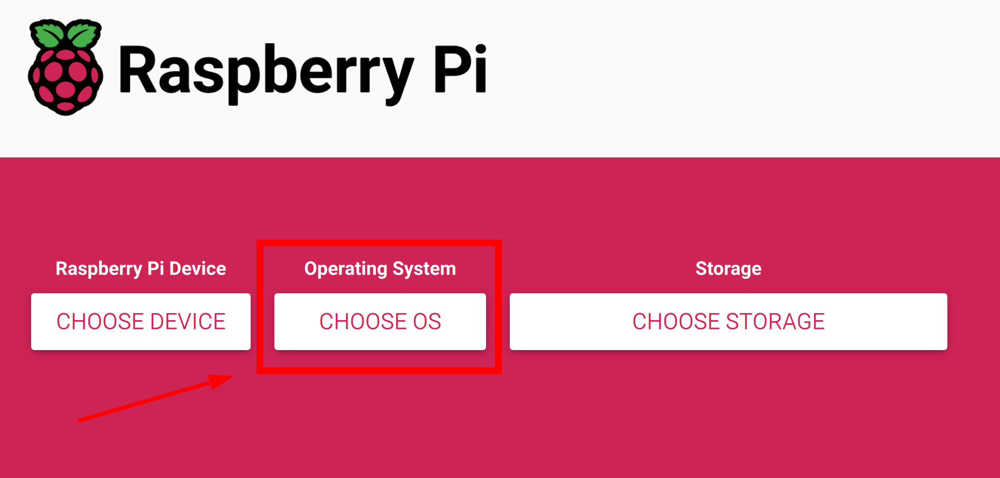
    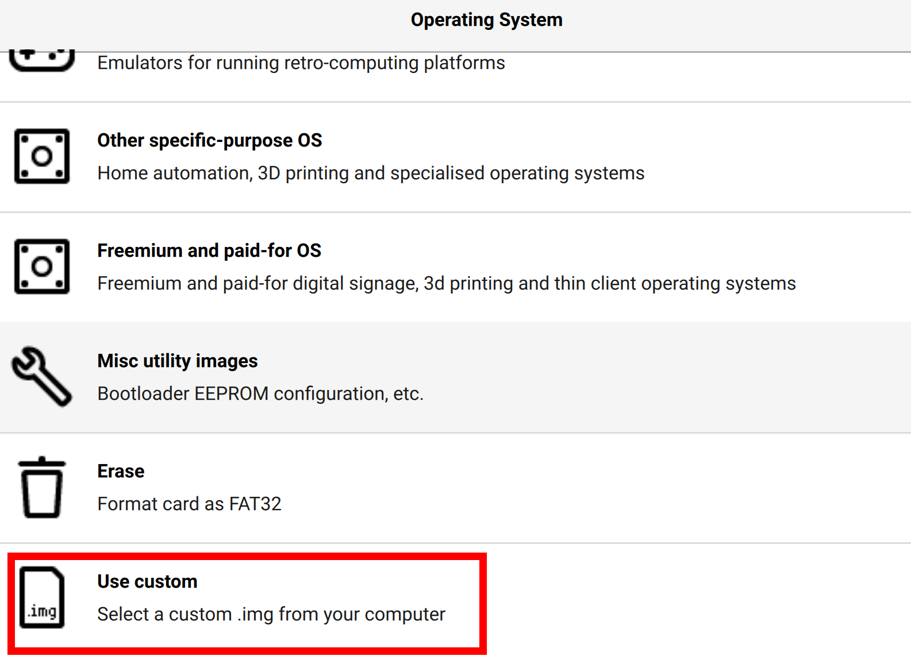
    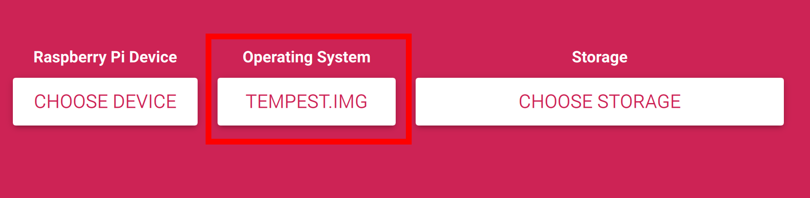
    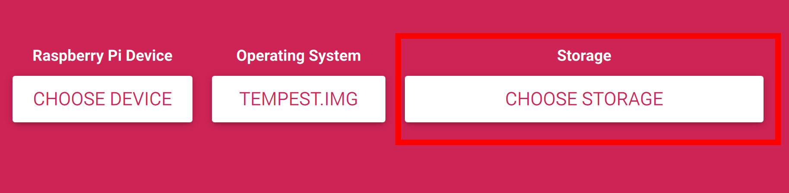
    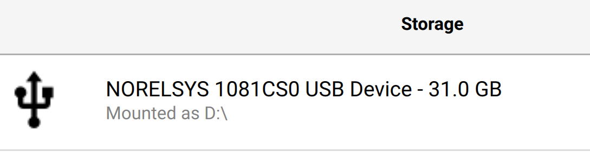
    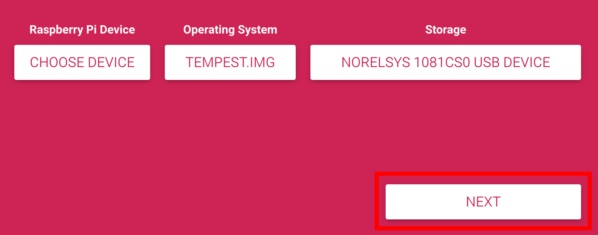

5. Click **`NEXT`**, then **`EDIT SETTINGS`**.

    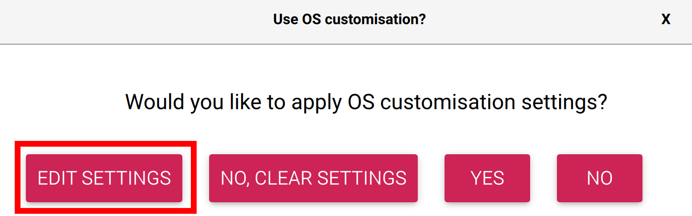

6. Configure the customizations. The image ships with the AP, SSH, and the
   FSW already provisioned — you only need to set the hostname:
    - **Hostname**: set to `TEMPEST-N` where `N` is a unique integer in your
      fleet (1–25). This is **critical**: the FSW derives the radio node
      address from the integer at the end of the hostname
      (`int(hostname.split("-")[1]) * 10`), so two units with the same
      hostname will collide on the air. Make sure every TEMPEST in your fleet
      has a different `N`.

        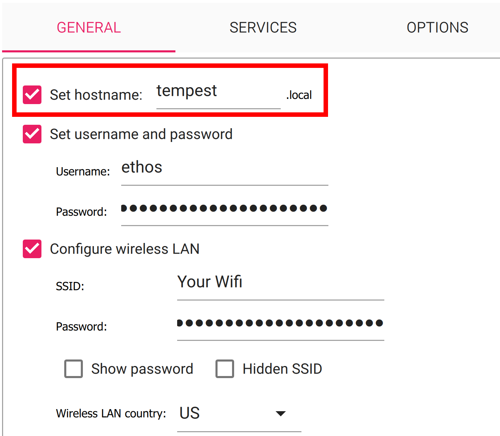
        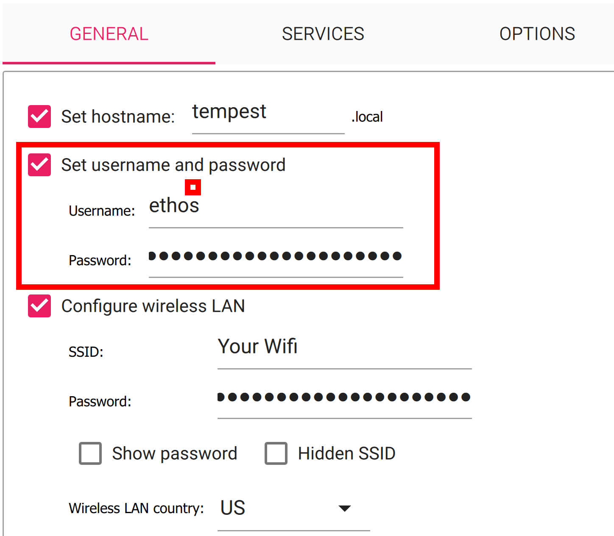

    - **Username/password**: leave at defaults (`tempest` / `tempest`).
      If you change the username here, that's fine — `install.sh` records
      the FSW directory by absolute path when it builds the service unit, so
      the service works under any home directory. The username itself isn't
      hardcoded anywhere in the FSW.

        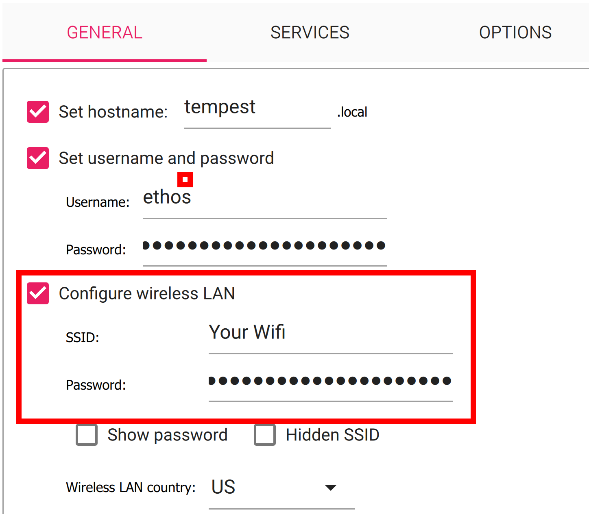

    - **WiFi / SSH**: skip these. The image is already configured to broadcast
      the `tempest-ap` access point on first boot and SSH is already enabled.
      Do not provide an external wifi SSID — the Pi Zero W has a single radio
      and a configured client network can prevent the AP from coming up.

7. **`SAVE`** the customizations, then **`YES`** to apply, then **`YES`** to
   confirm overwriting the card.

    
    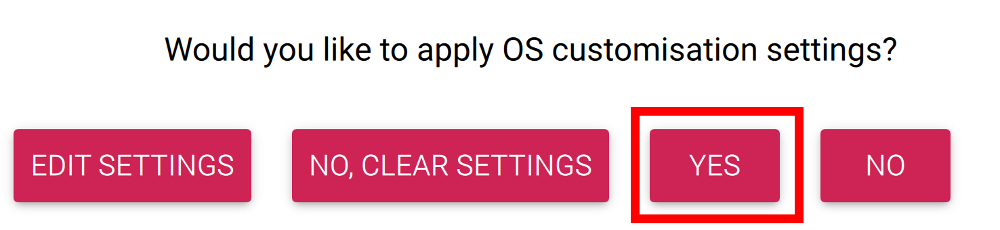
    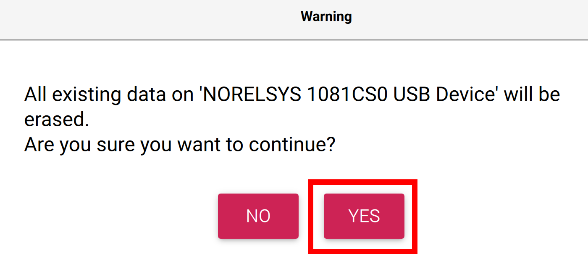

8. Wait for `Raspberry Pi Imager` to write and verify the image.

    
    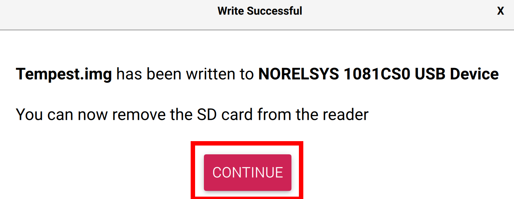

9. Eject the microSD card, reinstall it in the Pi Zero W, and power the
   satellite up. The Pi will shut down after ~30 seconds on first boot
   — this is expected. Insert and remove the RBF pin to reboot it.
10. After a few minutes the AP will be live. Look for the `tempest-ap` SSID
    (matching the hostname you set, e.g. `TEMPEST-3`) from your laptop and
    follow the [Connecting from Your Laptop](#connecting-from-your-laptop)
    steps above.

## Recovering an Unreachable Unit

If a satellite's AP is misconfigured or you've forgotten the PSK and can't
SSH in:

1. Power the Pi off, pull the microSD card, and mount it on your laptop.
2. Edit
   `/etc/NetworkManager/system-connections/tempest-ap.nmconnection` — adjust
   the `ssid` or `psk` field directly.
3. Reinsert the card and boot the Pi.

Alternatively, with physical access to the Pi (USB OTG keyboard + a USB→HDMI
adapter), log in directly on the console and run the `nmcli con modify`
commands from the [Rotating the AP Password](#rotating-the-ap-password)
section above.
