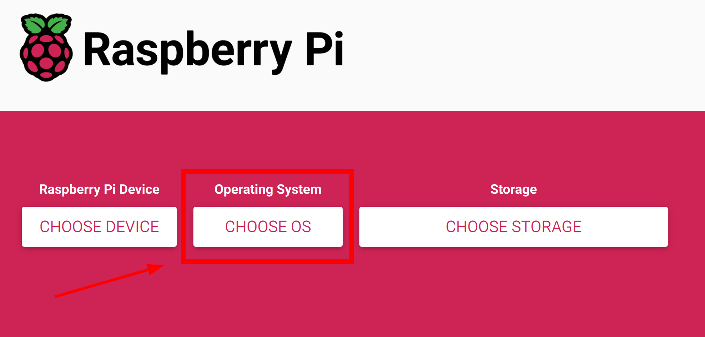
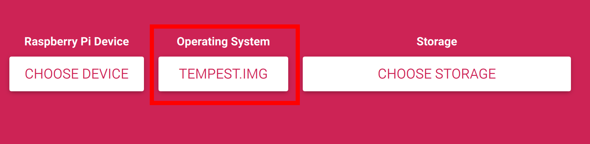
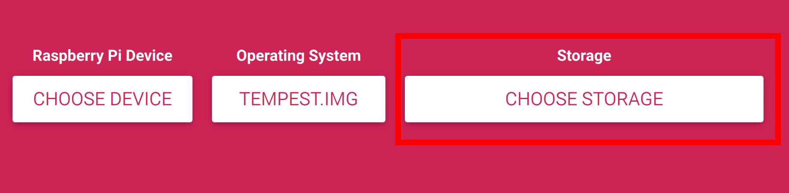
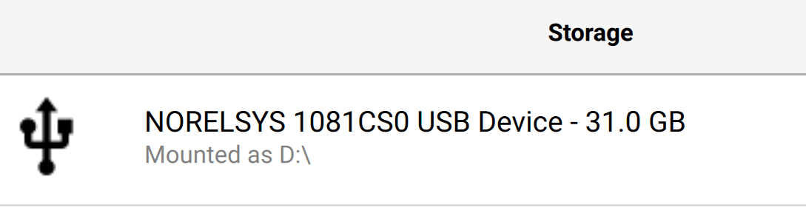
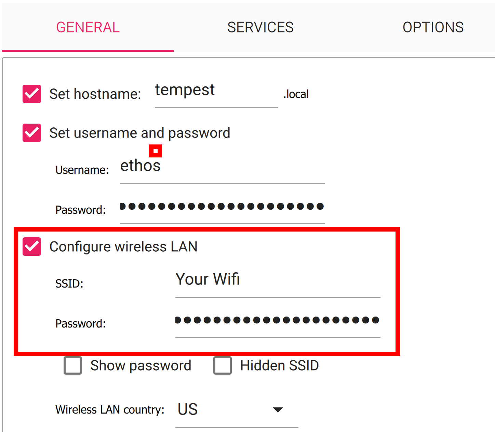
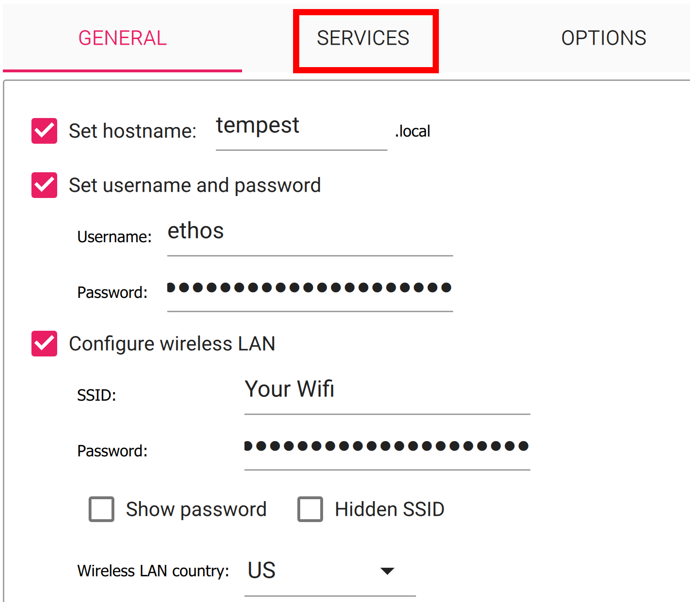
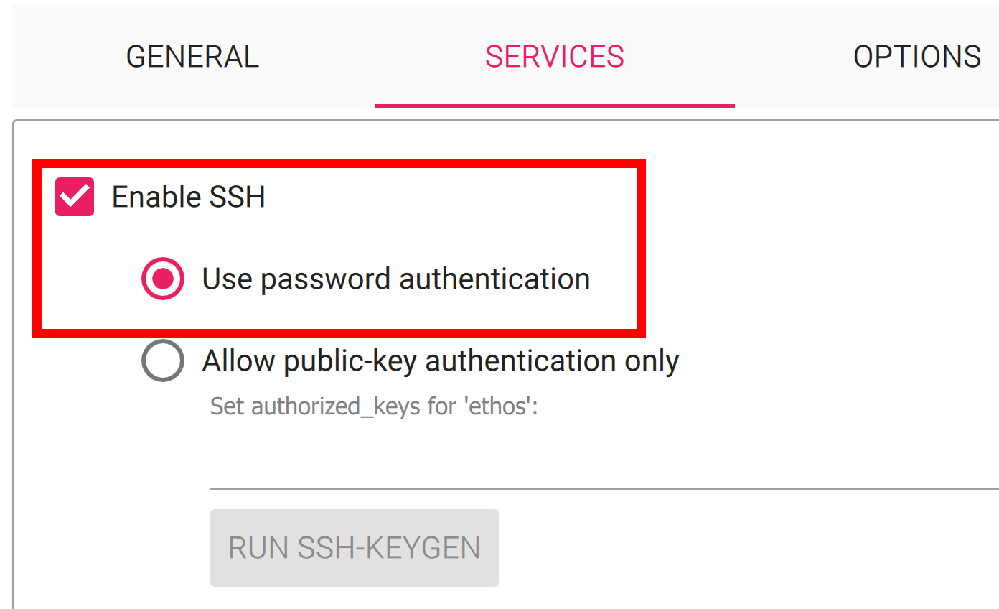
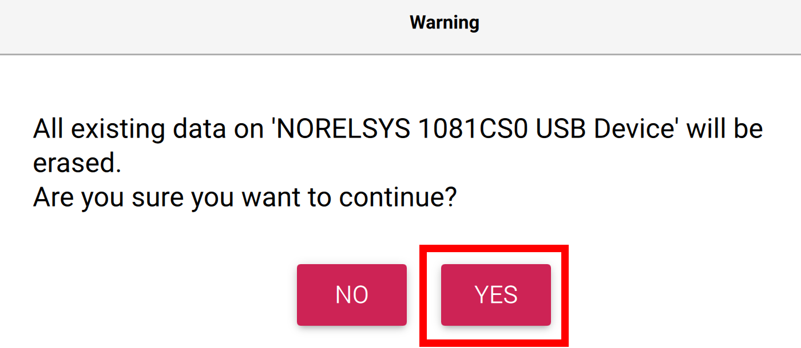

# How to connect TEMPEST to your Wi-Fi Network?

When you received your TEMPEST CubeSat, it was preconfigured to connect to the ETHOS Labs Wi-Fi network used in class. While you could recreate that network at home, it would be easier to have TEMPEST connect to your own Wi-Fi network.

The TEMPEST Flight Software (FSW) is running on a minimal Pi OS installation based on Bookworm. As a result, some of the legacy methods of easily configuring Wi-Fi on an existing image no longer work. 

As a result, the simplest way of getting your TEMPEST CubeSat to connect to your wireless network is to re-image your microSD card with the TEMPEST image using ```Raspberry Pi Imager``` and setting the appropriate values for your network.

Raspberry Pi Imager is a cross-platform solution for creating bootable media for Raspberry Pi and has built-in customization options.

You will need to download and install [```Raspberry Pi Imager```](https://www.raspberrypi.com/software/) for your appropriate operating system.

Once you have installed the software, you will need to download the TEMPEST image from the following link: [TEMPEST.img](https://drive.google.com/file/d/16SGQCWLUIjtlwZIXOSr-qfHSSttaX5Ga/view?usp=sharing).

After downloading the image, you can check if the image is valid by generating SHA256 hash and comparing it to this value:

 ```SHA256: B2B9A818FDA788B5C86BDEE69779F2D6651D71A360475ECEBFF68F761082B62E```.

 OR

 For TEMPEST v1.1, you can obtain the image here: [Tempest_v1.1.img]

 ```SHA256: 1b8bcd935839535602cd83294fcc94d98414a8966752e596f9455d1c1249bfef```.

Next you will want to take your microSD card out of TEMPEST by unscrewing the four T8 screws holding the X+ Solar Panel on the frame. If you do not know which panel is the X+ panel, if you are looking at the charging port/RBF pin panel, it will be on your left.

Once you open the panel, you can remove the microSD card from the onboard Raspberry Pi Zero W located on the bottom side of the lower PCB.

Next, connect the microSD card to your computer where you installed ```Raspberry Pi Imager```.

Open ```Raspberry Pi Imager``` and select the ```CHOOSE OS``` option in the middle of the screen as shown below.



A new window will open, and you will need to scroll all the way to the bottom of the window and select the option ```Use custom```.


After clicking on the ```Use custom``` option, your operating system's file browser will open up where you will be able to navigate to where you downloaded the ```Tempest.img``` file and select it.



Then select the ```CHOOSE STORAGE``` option on the right side of the GUI as shown in the image below.



You will now want to select your microSD card that is connected to your computer. If you are using the card that came with TEMPEST, it will say ```31.0 GB``` but the name of the Card/Device will be different than what is shown below. If you have more than one storage device showing, make sure you select the correct one.



With your storage device chosen, you can now click ```NEXT``` in ```Raspberry Pi Imager```.


A new window will open up and on the far-left side you will find the option to ```EDIT SETTINGS```. Click on that option and a new window will open.


In the new window you will have options to customize your TEMPEST installation such as hostname and wireless network.


Changing the hostname is completely optional, and if you do not change it, it will be ```TEMPEST```.


Likewise, it is not required to change the username and password, and it is recommended you use the defaults by making use ```Set username and password``` are unchecked. You can also manually set the username and password to the defaults using: ```ethos:hack ethos```.



The next section is the Wi-Fi section, and you will certainly want to complete this section by providing your wireless network SSID and password. Also, double check your ```Wireless LAN Country``` code is correct. The image is set to the ```US```.



After setting your Wi-Fi information, you will want to click on the ```Services``` tab and make sure ```Enable SSH``` is clicked as well as ```Use password authentication``` is checked.



Once you have enabled ```SSH``` you can click on the ```SAVE``` button located at the bottom of the window.


Clicking ```SAVE``` will take you back to the OS customization window where you will want to click on ```YES``` to apply the custom settings to your image.


A warning window will open informing you that all data on the selected storage device will be erased. Click on ```YES```.



```Raspberry Pi Imager``` will then write the customized TEMPEST image. 


Once the write operation is complete, the image will be verified and once that process is done a window will popup stating ```Write Successful``` and that you can remove the microSD card from your computer. Click ```CONTINUE``` to acknowledge.


Now you can remove the microSD card from your computer and reinstall it in TEMPEST. 

Next, power up TEMPEST and it will boot into the new image. However, after booting up, the onboard Raspberry Pi Zero W will shut down after about 30 seconds. This is expected behavior, and you can reboot it simply by inserting your RBF pin and then removing it once again. 

It is suggested that you power up TEMPEST without securing the X+ panel so that you can see the green LED indicator on the Pi. Once it has shut down and you reboot it, you can then secure the panel back on using the four T8 screws you previously removed.

One the second boot, it will take upwards of 8-10 minutes for the system to full boot and connect to your Wi-Fi network. Again, this is expected behavior, so just be patient.

Once the Pi is fully booted, the FSW will automatically start running and will be signaled by a tone from the onboard buzzer. 

The FSW will more than likely be running before the entire network stack is up and running, so you may not see TEMPEST on your network for several more minutes, so just be patient. 

After about 10 minutes, your TEMPEST CubeSat should be up as a device on your network, and you typically can retrieve the IP address by looking at your network’s DHCP leases. 

After getting the IP address of your TEMPEST CubeSat, you will be able to SSH into it with the default credentials, or the ones you set when creating the microSD card.


