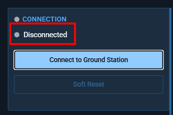
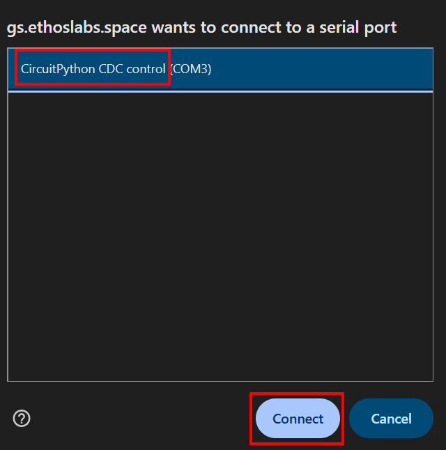
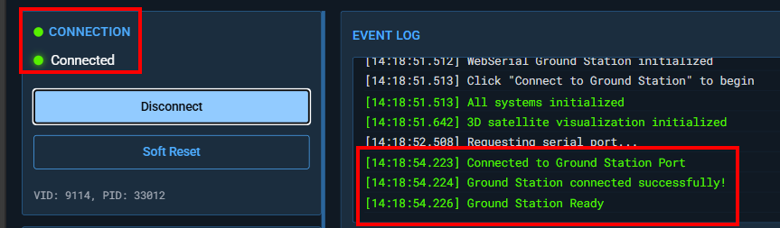
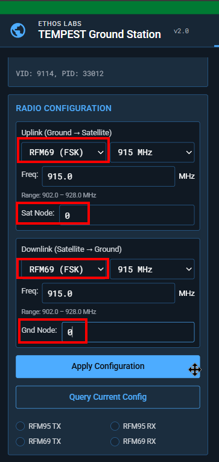
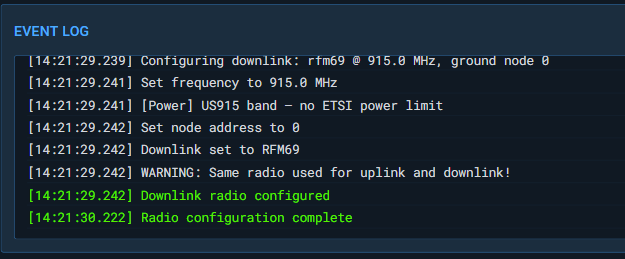
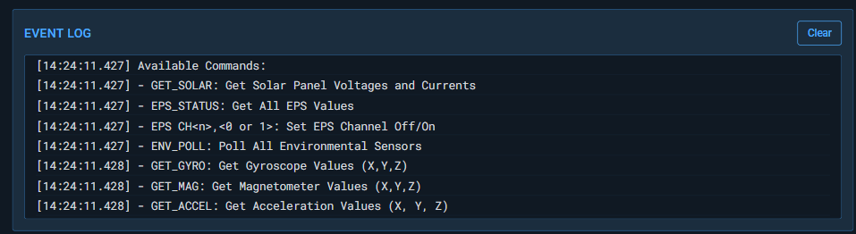

# WebSerial Interface

## Connecting to the Ground Station

### Step 1: Open the Interface

Navigate to the ground station URL in Chrome or Edge. The interface loads with all controls disabled until a serial connection is established.

### Step 2: Connect

1. Click **"Connect to Ground Station"**
2. A browser dialog appears listing available serial ports
3. Select the GS Pico MCU USB port

4. The connection establishes with default serial parameters:

| Parameter | Default |
|-----------|---------|
| Baud Rate | 115200 |
| Data Bits | 8 |
| Stop Bits | 1 |
| Parity | None |
| Flow Control | None |

Upon successful connection:

- The status indicator turns green
- GSB Serial monitor shows "On" with a green status symbol
- Command input and buttons become enabled
- The event log shows "Connected to serial port"

### Step 3: Configure Radios (if needed)

The Radio Configuration panel lets you set uplink and downlink parameters independently:

- **Radio Type**: RFM95 (LoRa) or RFM69 (FSK)
- **Band**: 433 MHz, 868 MHz, or 915 MHz
- **Frequency**: Specific frequency within the selected band
- **Node Address**: Satellite node (uplink) / Ground node (downlink)

Click **"Apply Configuration"** to send configuration commands to the GS Pico MCU.

## Sending Commands

### Text Input

Type any command in the command input field and press Enter or click **"Send Command"**. The command is sent to the GS Pico MCU which forwards it via radio.

### Quick Commands

Preset buttons send common commands with a single click:

| Button | Command |
|--------|---------|
| Solar | `GET_SOLAR` |
| EPS | `EPS_STATUS` |
| Gyro | `GET_GYRO` |
| Orient | `GET_ORIENTATION` |
| BME | `GET_BME` |
| Accel | `GET_ACCEL` |
| Mag | `GET_MAG` |
| Temp | `GET_TEMP` |
| Disk | `OBC_DISK` |
| RAM | `OBC_RAM` |
| Proc | `OBC_PROCESSES` |
| Host | `GET_HOSTNAME` |
| WiFi | `WIFI_INFO` |

### All Commands Reference

Click **"All Commands"** to display the full command list in the event log. See [Command Protocol](image-10.png) detailed documentation.

## Event Log

The event log (terminal) displays all communication with timestamps:

| Message Type | Color | Description |
|-------------|-------|-------------|
| `info` | Default | System messages, help text |
| `command` | Accent | Commands sent to satellite |
| `response` | Green | Telemetry data received |
| `warning` | Yellow | Validation warnings, missing packets |
| `error` | Red | Connection errors, parse failures |

Click **"Clear"** to reset the event log.

## Live Telemetry

The telemetry panel updates automatically when packets are received. It's organized into three sections:

### Onboard Computer

| Field | Source | Updated By |
|-------|--------|------------|
| CPU | `OBCC` or `BECN` | OBC_CPU command or beacon |
| RAM | `OBCR` or `BECN` | OBC_RAM command or beacon |
| Disk | `OBCD` or `BECN` | OBC_DISK command or beacon |
| Temp | `BME2`, `TEMP`, or `BECN` | GET_BME, GET_TEMP, or beacon |

### Power System

| Field | Source |
|-------|--------|
| Battery | `EPSS` battery voltage |
| EPS Status | `EPSS` error code (OK or E{code}) |
| Ch 1–4 | `EPSS` channel states (ON/OFF) |

### Solar Panels

| Field | Source |
|-------|--------|
| X-, X+, Y-, Y+ | `SOLR` voltage and current per panel |
| Total Power | Calculated: sum of (V × I / 1000) for all panels |

## Satellite Orientation (3D)

The orientation panel shows a Three.js 3D model of the satellite that updates when `ADCS` or `GET_ORIENTATION` data is received.

- **Roll (X)**: Rotation around the forward axis
- **Pitch (Y)**: Rotation around the lateral axis
- **Yaw (Z)**: Rotation around the vertical axis (heading)

Click **"Update"** to request fresh orientation data.

The 3D model shows:

- Colored cube body (RGB faces for axis identification)
- Solar panels on the X-axis sides
- Antenna on the Y+ axis
- X/Y/Z axis indicators and grid

## Classification Banners

Classification banners appear at the top and bottom of the interface. Change the classification level in the **Configure** tab:

| Level | Banner Color |
|-------|-------------|
| UNCLASSIFIED | Green |
| CUI | Purple |
| SECRET | Red |
| TOP SECRET | Orange/Yellow |
| TOP SECRET//SCI | Orange/Yellow |

!!! Note
    This is eye candy and should not be taken as a real classification. 

## Soft Reset

The **"Soft Reset"** button sends CTRL-C followed by CTRL-D to the GS Pico MCU, which can reset the serial connection without a full disconnect/reconnect cycle.
