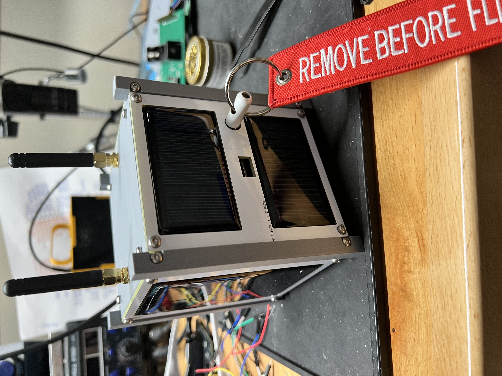

# ETHOS Labs - TEMPEST CubeSat

    T.E.M.P.E.S.T is a purposefully vulnerable 1U CubeSat (Flat sat technically) that has been designed from the ground up for the purpose of not only teaching fundamental elements of Space Systems, but to do some with the focus on cybersecurity. It's hard to be sure but we believe this may be the first of its kind in terms of purpose and hardware. Not that it really matters.

The CubeSat was developed for students of ETHOS Labs' founder, Tim Fowler's Introduction to Cybersecurity in Space Systems course to allow students to go hands on with hardware, instead of being stuck in the land of theory and simulation. 

Eventually we will get around to documenting much of TEMPEST's design from a hardware perspective as well plans to open-source both the PCB designs as well as the various software components used. 

## Design

There are lots of CubeSats that are available for purchase for educational purposes, but they are often designed to replicate a real satellite's functions and capabilities, but often not done in a secure manner. In fact, much the space industry as a whole, security is often a secondary thought, not the primary driving force. We get it, trust us, we do but we also believe we can do better as an industry. 

As a result, TEMPEST, while fully custom, many design choices were made based on existing solutions. We took the best of the best and added it all into one single platform. Well, we have tried to do that.

Design elements from three different commercial CubeSats were chosen for their realism as well as their ability to showcase potential weaknesses within the spacecraft that could be leveraged or manipulated by an attacker to potential devastating (if it was real) results.

