# Building Your TEMPEST CubeSat


**This is the build guide for the TEMPEST v1.1 CubeSat (Feb 2025).**


Step 1: Find your bottom Z-Axis plate (Z-) with the camera attached and retrieve the flexible ribbon cable from the ```OBC``` bag. 
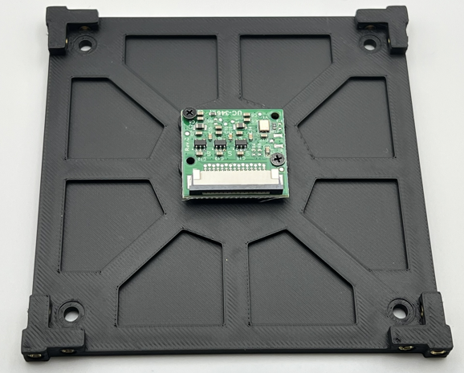

Carefully unlock the connector on the camera by gently pulling on each side of the black tab.

Next slide the matching end of the ribbon cable into the slot on the camera, pin side down, and then gently push each side of the locking mechanism on the camera to secure the cable.

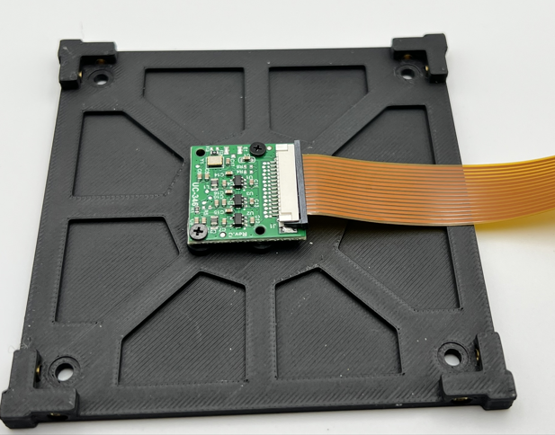

Step 2: Take the Raspberry Pi Zero  (```OBC```) out of the ```OBC``` bag.

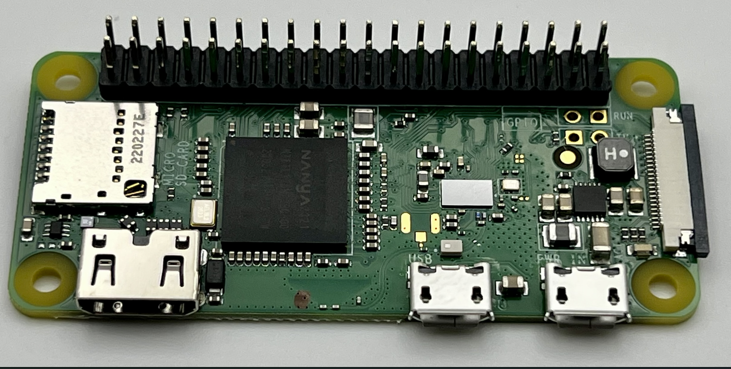

Find your microSD card and insert it into the microSD card slot on the left side of the board.


Now from your ```Hardware``` bag, find the bag with three 11mm stand offs in it and take three M2.5x8mm T8 screws out of the bag of screws. 

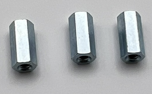

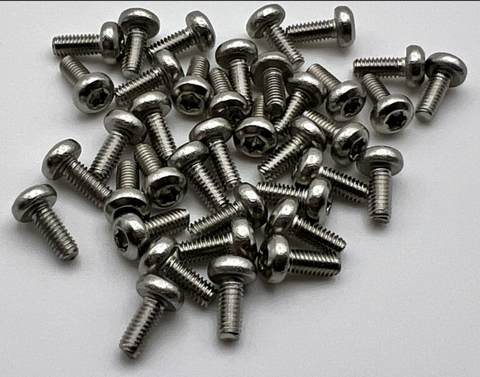

Inserting the screws from the bottom of the ```OBC```, secure the three 11mm standoffs onto the ```OBC``` as shown in the image. Note the top right hole will be left unpopulated. 


The completion of this step should look like the following images.

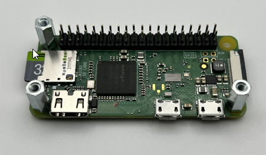

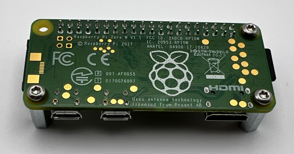

Step 3: Now take your ```Solar Board``` from its bag and attach the ```OBC``` to the bottom of the ```Solar Board``` via the 2x20 pin header on the bottom side. Be careful not to crunch any of the pins on the ```OBC``` while doing this.


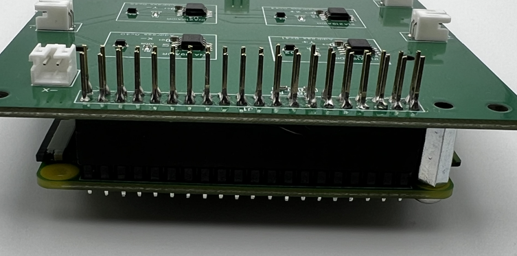

Next grab three more M2.5x8mm T8 screws and secure the ```OBC``` assembly to the ```Solar Board``` as shown in the following image:

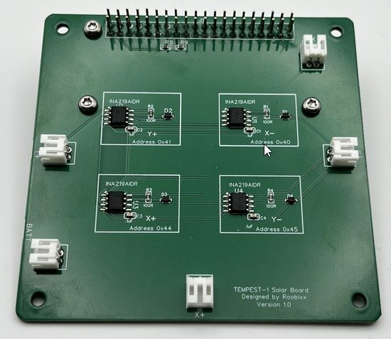

Step 4: In your hardware bag, there will be a bag of 12x M2.5x20mm male standoffs. Take eight (8) out of the bag. Using two (2) per corner, screw the standoffs together, sandwiching the ```Solar Board``` assembly as shown below. Repeat for all four (4) corners.

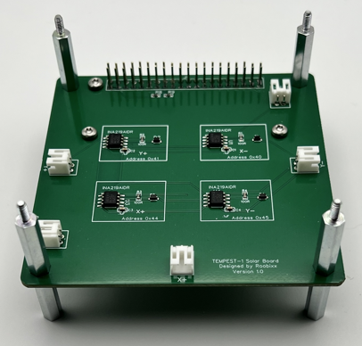

Step 5: The next step is to prepare the ```EPS``` for stacking on the``` Assembly``` by taking one (1) of the 2x20 pin headers from the connector bag.

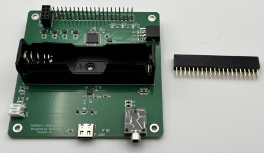

 Now, carefully insert the  connector pins into the header on the bottom of the ```EPS``` board. Make sure to fully seat the header against one on the ```EPS``` board.

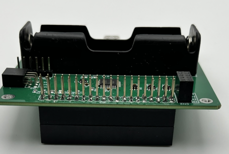

Step 6: With the header stacked on the ```EPS``` board, carefully connect it to the assembly, taking care to align the pins and the standoffs. Start my getting everything aligned and then you can apply more pressure until the ```EPS``` board bottoms out on the top of the standoffs.

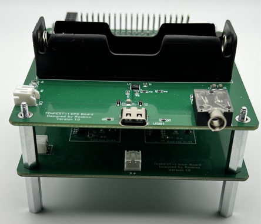

Step 7: With the``` EPS``` board added to the assembly, take four (4) M2.5x20mm male standoffs and secure the``` EPS``` board down as shown below.

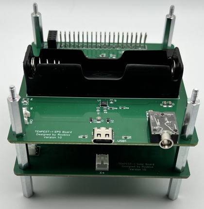

Step 8: Find your red ```Remove Before Flight``` tag (```RBF```) and insert into the 3.5mm jack on the left side of the``` EPS``` board.

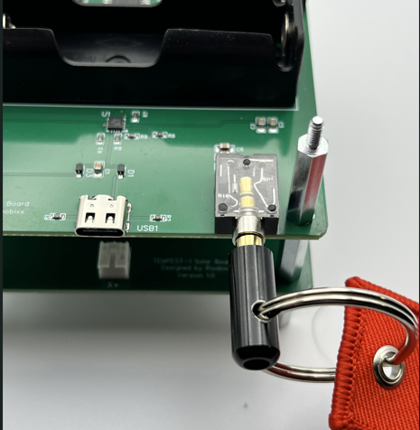

Step 9: With the ```RBF``` pin firmly in place, you can now insert your ```18650 battery```. Take note that the Positive (+) terminal of the battery holder is on the RIGHT. 

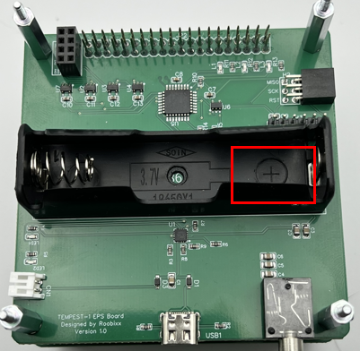

You will need to identify the positive (+) terminal of your battery and make sure you match them up when inserting the battery.


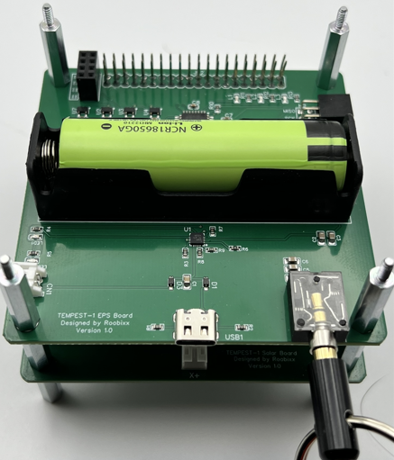

Step 10: The last step from the ```EPS``` board at this time is to find the 2x4 pin header on the upper left side of the board at the back. 

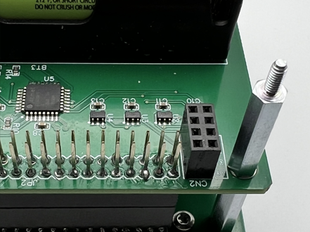

You will take your two (2) 1x4 header pins and insert one into each side of the 2x4 pin header as shown (our colors may vary).

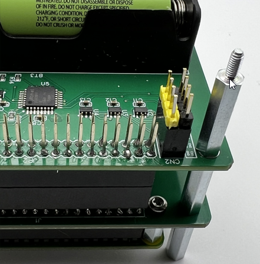

Step 11: Now you need to prep your ```Payload/Comms``` board. 

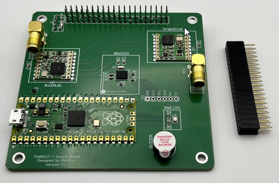

To do this, you will take the remaining 2x20 pin header from the connector bag and attach it to the bottom of the ```Payload``` board, making sure to push it so that it is fully seated on the header on the bottom of the ```Payload``` board.

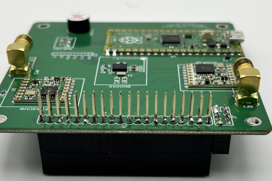

Step 12: Carefully attach the ```Payload``` board assembly to the rest of the assembly, making sure to align all the pins, included the set of 1x4 pins. Once you have all the pins aligned and it is starting to go down onto the stack, apply pressure until the board is fully seated on the tops of the standoffs.


Step 13: Using the four (4) 30mm female standoffs from the hardware bag, secure the ```Payload``` board onto the stack.

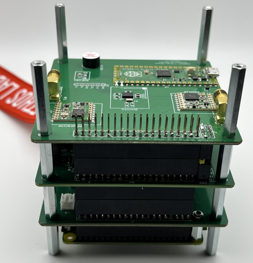

Step 14: With the entire hardware stack built, flip it over so that the ```OBC``` is on top. Carefully unlock the camera connector locking mechanism on the side opposite of the ```microSD``` card. 


With the lock open, take your bottom ```Z-axis plate``` with the camera/cable attached and bring it close to your stack. Insert the free end of the ribbon cable into the slot on the ```OBC```, pins facing up toward you. Once the cable is seated in the slot, carefully lock it into place with the locking mechanism. Do one side then the other.

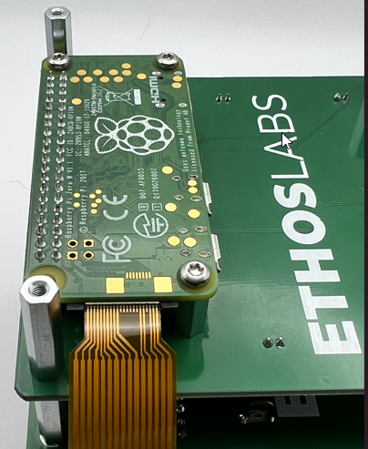

Step 15: This step can be a little tricky, as you will need to secure the bottom ```Z-axis plate``` onto the stack using four (4) M2.5x8mm screws. To do this you will need to fold the ribbon cable carefully as you put the plate on. Do not crimp or crease the ribbon. 

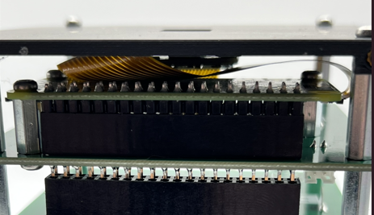

It is important that the plate be oriented correctly, with the camera lens cable facing away from you and the side of the plate having four screw holes instead of two. 

Once you have the plate oriented, you can screw it down using the four (4) screws into the standoffs as shown below.

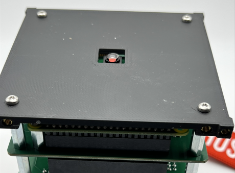

Step 16: Flip your assembly over and set it on the bottom plate. 


Grab the two (2)``` SMA pigtails``` from the``` Antenna``` bag. Starting on the left side, attach the straight end of the ```SMA pigtail``` to the SMA connector on the ```Payload``` board by screwing it on. Bring the rest of the pigtail so that is sits in between the two front stand offs as shown. 

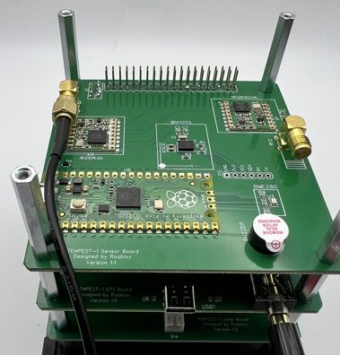

Next, take the front right standoff of the stack for a moment and set it aside. 

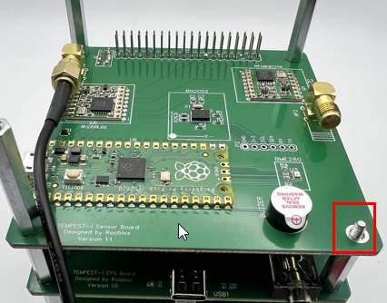

Take the remaining ```SMA pigtail``` and connect it to the SMA connector on the right side of the ```Payload board```. After the second pigtail is connected, you can replace the removed standoff, just making sure to keep the second pigtail on the inside of it as shown.

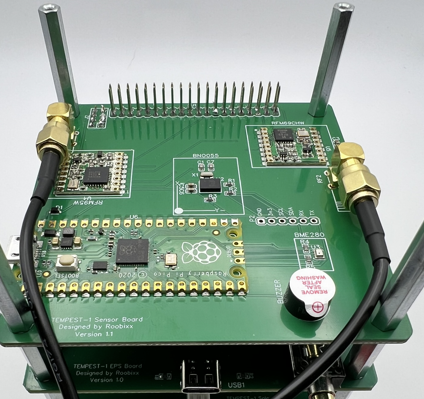

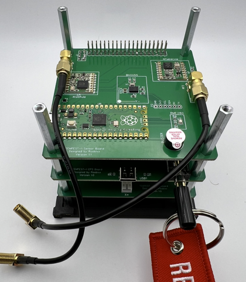

Step 17: In the ```Antenna``` bag, you will find a smaller bag with two (2) antennas and some washers and nuts. Take the two (2) serrated washers and install them on the right angle ends of the SMA pigtails. 

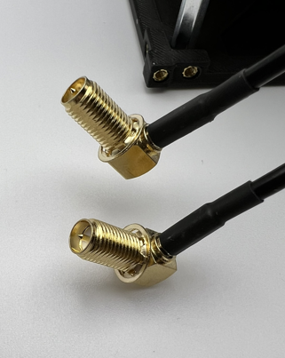

Next grab your top ```Z-axis plate``` and insert the two right angle ends of the pigtails into the holes on the plate so that they protrude out the smooth side of the plate. 


Secure them using the lock washer and nut from the top side of the plate. Do not over tighten as you will need them to be able to move some for the next step.

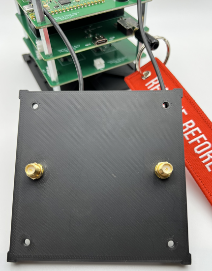

Step 18: With the ```SMA pigtails``` connected to the ```Z-axis``` top plate, you will need to secure the plate to the stack. To do this you will need to rotate the plate one full rotation, 360 degrees, to have the pigtails twist around each other. Doing this, should take up the slack and you will be able to set the plate down on the standoffs, aligning them with the four holes in the plate. 

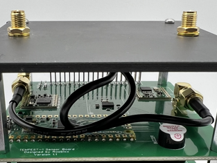

Using four (4) screws secure the plate to the stack, making sure the edge of the plate that is facing you (X+ axis) has four (4) screw holes in it.

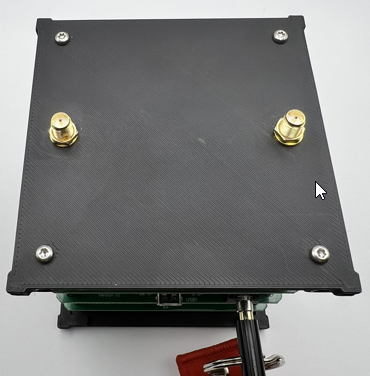

Step 18: Find the bag labels``` Rails``` and take them out of the bag. You will also need eight (8) M2.5x8mm T8 screws for this step. Once you have the rails and screws, you can gently add the rails to the assembly and secure them in place with two (2) screws per rail, one on each of the Z-axis plates. Do this for all four (4) corners.

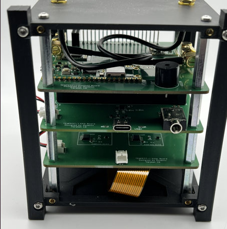

Step 19: In your connector bag you will have a single two-wire jumper. Using the jumper, you will need to connect the ```Solar``` board and ```EPS``` board using the connectors on the right-hand side of the assembly if you rotate it 90 degrees counter-clockwise so that the``` Y+ axis``` is facing you.

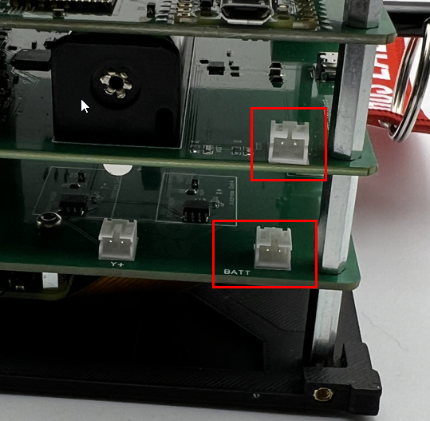

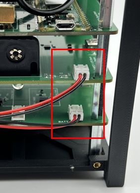

You can tuck the excess wire in beteen the two boards as shown below.

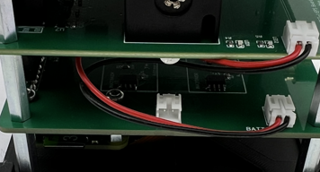

Step 20: Now open your ```Solar Panel``` bag and find the three (3) single panel PCBs. You will also need twelve (12) M2.5x8mm T8 screws for this step. Staring on the ```Y+ axis```, you can connect the jumper lead from the PCB to the solar board, then using four (4) screws, secure the PCB to the assembly. 

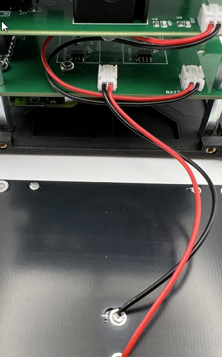

Repeat the same steps for the``` Y-``` axis. Note that the ```Solar``` board has lettering indicating which axis it what.

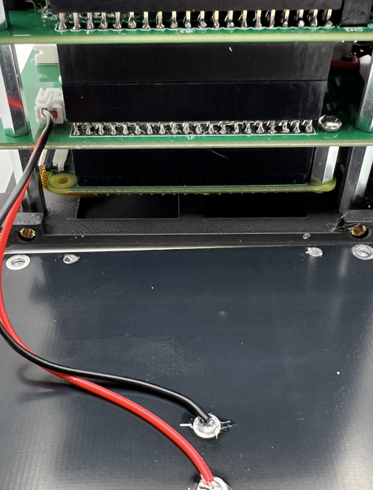


 Repeat the same steps for the ```X- ```axis. 

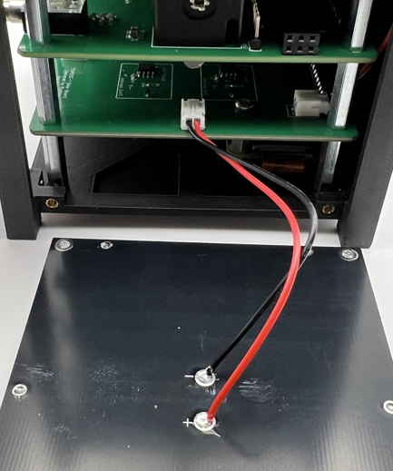

Step 21: Before installing the last ```Solar Panel``` PCB, if you have not already attached your two (2) antennas to the top of your CubeSat, do that now. Take care not to try to tighten them too much. Snug is good enough.

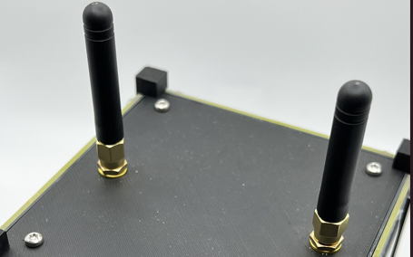

Step 22: You should have just a single PCB left, which has two solar panels on it. You will need it and four (4) M2.5x8mm T8 screws for this step. Just like the previous step, you will be installing this panel, however you must first remove the RBF pin. Doing so will cause the CubeSat to power up. 

You will see some flashing lights from the EPS board as well as hear some beeps from the on-board buzzer.

These are all good signs things are working as expected. Now, connect the jump lead to the X+ connector on the ```Solar``` board. 

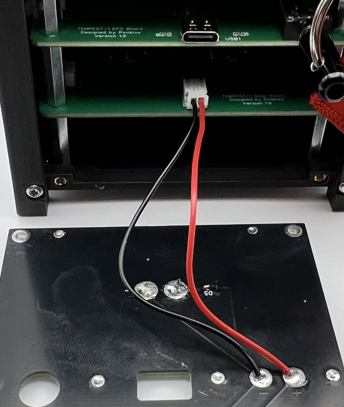

Then you can hold the PCB panel up to the X+ axis and then through the hole that aligns with the RBF pin jack, replace the RBF pin and then you can secure the panel with the four (4) remaining screws.

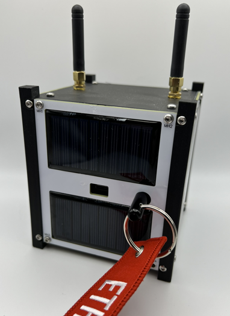

Congratulations, your CubeSat should now be assembled!


