## Onboard Computer (OBC)

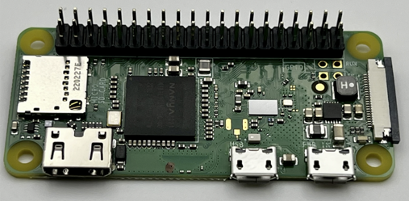

## Solar Board

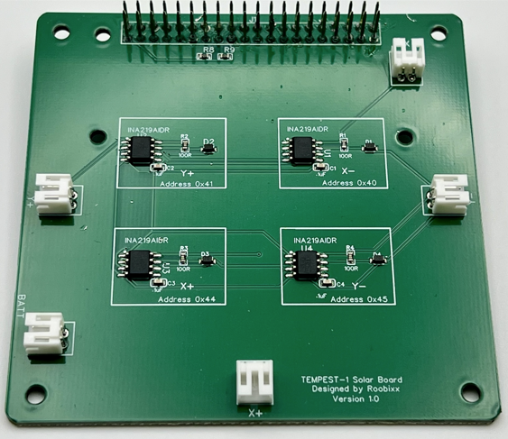

## Electircal Power System (EPS)

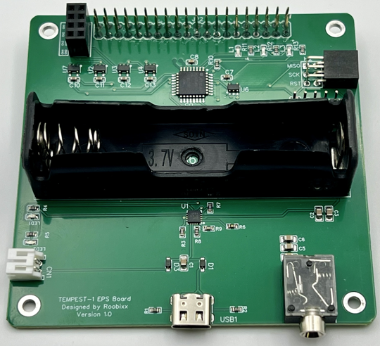

## Payload / Comms Board (Payload)

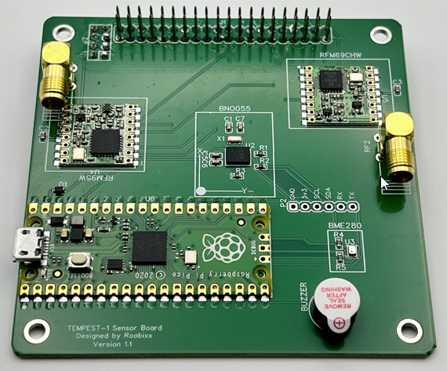 

## Ground Station

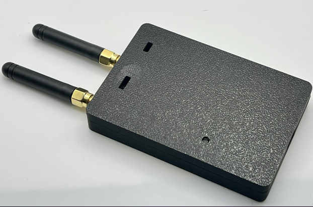

## Z-Axis Plates

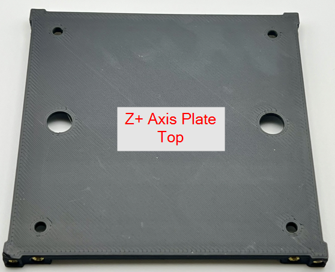

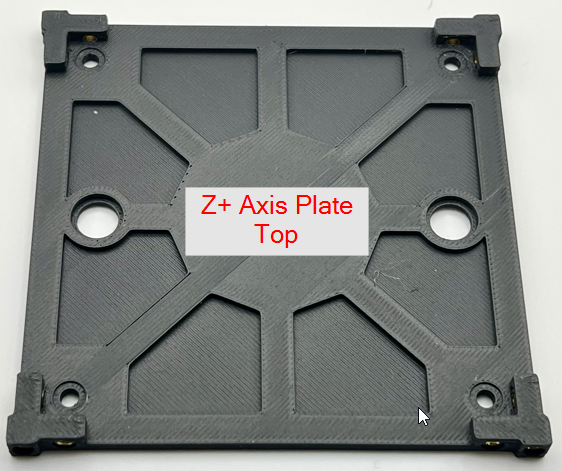

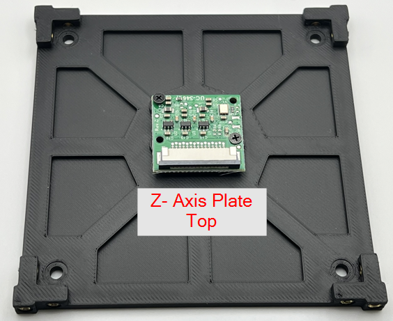

## Solar Panel PCBs

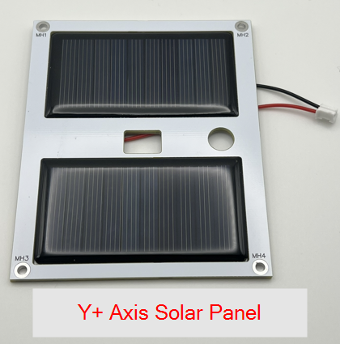

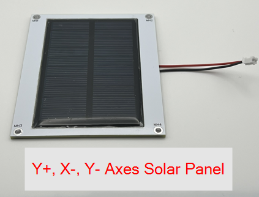

## Hardware

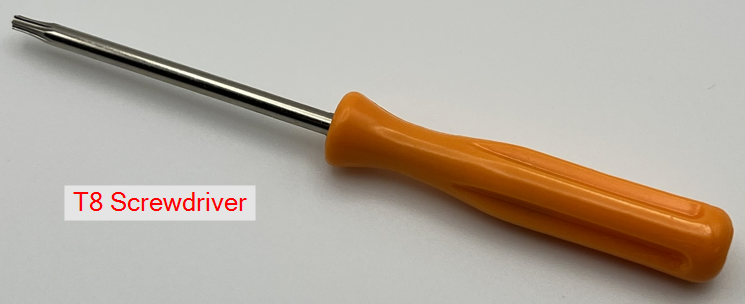

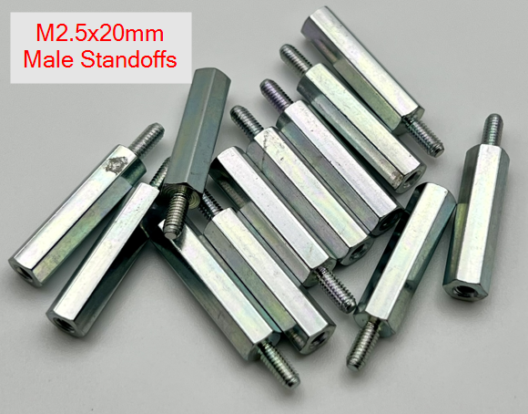

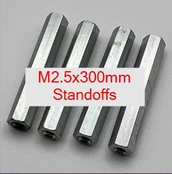

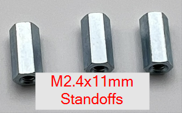

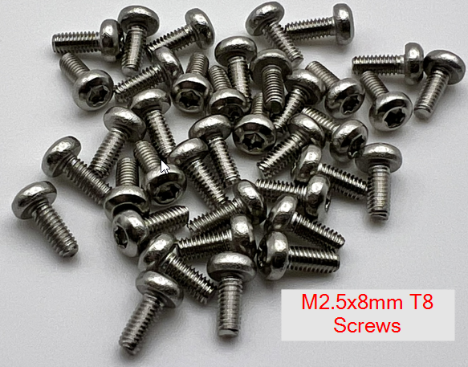

## Connectors

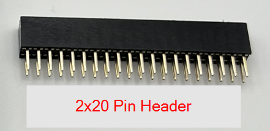

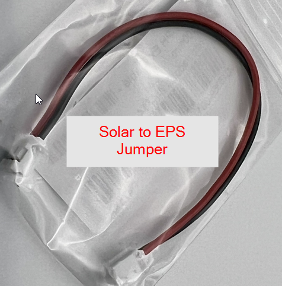

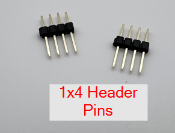

## Antennas

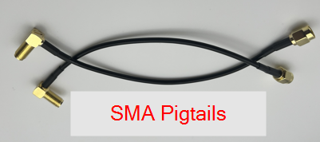

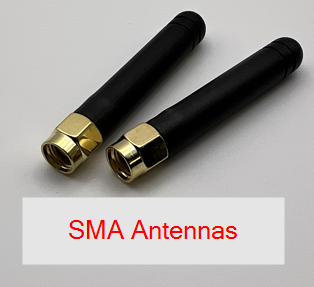