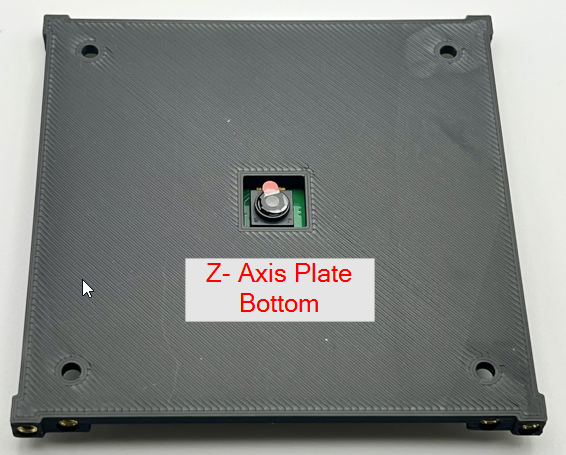

## Onboard Computer (OBC)

## Solar Board

## Electircal Power System (EPS)

## Payload / Comms Board (Payload)

 

## Ground Station

## Z-Axis Plates

## Solar Panel PCBs

## Hardware

## Connectors

## Antennas

